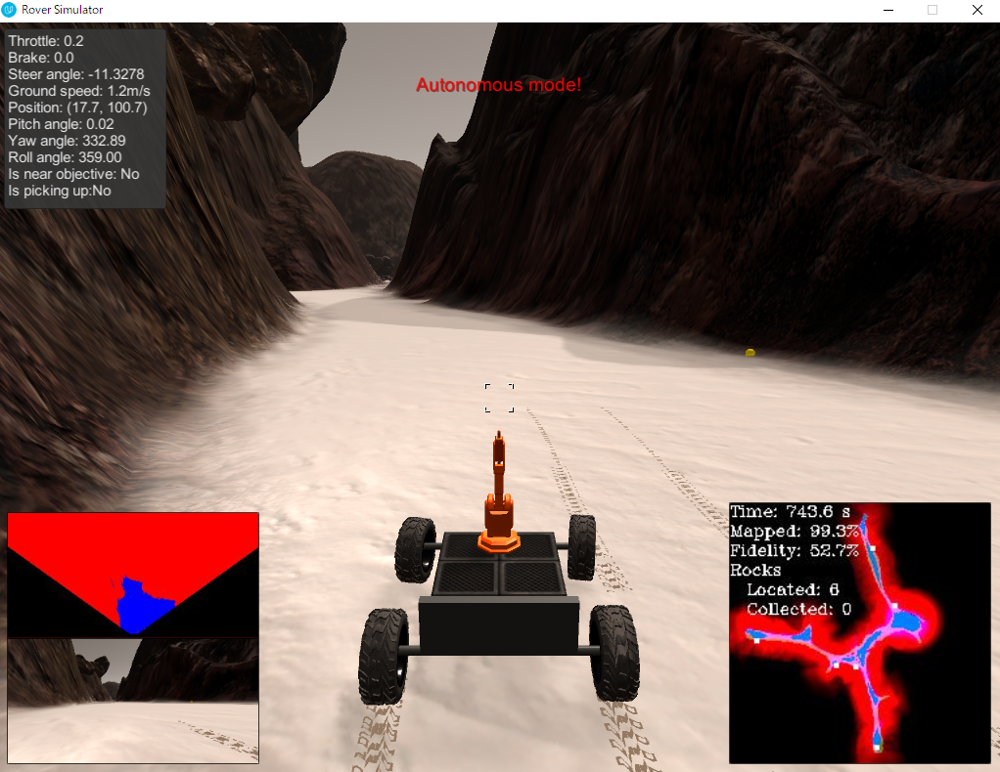

## Project: Search and Sample Return

---


**The goals / steps of this project are the following:**  

**Training / Calibration**  

* Download the simulator and take data in "Training Mode"
* Test out the functions in the Jupyter Notebook provided
* Add functions to detect obstacles and samples of interest (golden rocks)
* Fill in the `process_image()` function with the appropriate image processing steps (perspective transform, color threshold etc.) to get from raw images to a map.  The `output_image` you create in this step should demonstrate that your mapping pipeline works.
* Use `moviepy` to process the images in your saved dataset with the `process_image()` function.  Include the video you produce as part of your submission.

**Autonomous Navigation / Mapping**

* Fill in the `perception_step()` function within the `perception.py` script with the appropriate image processing functions to create a map and update `Rover()` data (similar to what you did with `process_image()` in the notebook).
* Fill in the `decision_step()` function within the `decision.py` script with conditional statements that take into consideration the outputs of the `perception_step()` in deciding how to issue throttle, brake and steering commands.
* Iterate on your perception and decision function until your rover does a reasonable (need to define metric) job of navigating and mapping.  

[//]: # (Image References)

[image1]: ./misc/rover_image.jpg
[image2]: ./calibration_images/example_grid1.jpg
[image3]: ./calibration_images/example_rock1.jpg

## [Rubric](https://review.udacity.com/#!/rubrics/916/view) Points
### Here I will consider the rubric points individually and describe how I addressed each point in my implementation.  

---
### Writeup / README

#### 1. Provide a Writeup / README that includes all the rubric points and how you addressed each one.  You can submit your writeup as markdown or pdf.  

You're reading it!

### Notebook Analysis
#### 1. Run the functions provided in the notebook on test images (first with the test data provided, next on data you have recorded). Add/modify functions to allow for color selection of obstacles and rock samples.
I implement two functions to find obstacles and rock, `color_thresh()`and `find_rocks()`. The function of `color_thresh()` is to get the obstacle around Rover. The function of `find_rocks()` is to get rocks from the view of Rover.
```python
def color_thresh(img, rgb_thresh=(160, 160, 160)):
    # Create an array of zeros same xy size as img, but single channel
    color_select = np.zeros_like(img[:,:,0])
    # Require that each pixel be above all three threshold values in RGB
    # above_thresh will now contain a boolean array with "True"
    # where threshold was met
    above_thresh = (img[:,:,0] > rgb_thresh[0]) \
                & (img[:,:,1] > rgb_thresh[1]) \
                & (img[:,:,2] > rgb_thresh[2])
    # Index the array of zeros with the boolean array and set to 1
    color_select[above_thresh] = 1
    # Return the binary image
    return color_select

  def find_rocks(img, levels=(110, 110, 50)):
      rockpix = ((img[:,:,0] > levels[0]) \
                        & (img[:,:,1] > levels[1]) \
                        & (img[:,:,2] < levels[2]))

      color_select = np.zeros_like(img[:,:,0])
      color_select[rockpix] = 1
      return color_select
```

#### 1. Populate the `process_image()` function with the appropriate analysis steps to map pixels identifying navigable terrain, obstacles and rock samples into a worldmap.  Run `process_image()` on your test data using the `moviepy` functions provided to create video output of your result.
First, I applied the perspective Transform and mask to the view image, where the argument of `source` and `destination` are the coodinate transform matrix.
```python
# Perspective Transform and mask
warped, mask = perspect_transform(img, source, destination)
```

Then, to make the world map I applied the color threshold to identify the objects from the view of Rover.
```python
# Apply color threshold to identify navigable terrain/obstacles/rock samples
threshed = color_thresh(warped)
obs_map = np.absolute(np.float32(threshed) - 1) * mask
xpix, ypix = rover_coords(threshed)
```

Then, I converted pixel position to world coords.
```python
# 5) Convert rover-centric pixel values to world coords
world_size = data.worldmap.shape[0]
scale = 2 * dst_size
xpos = data.xpos[data.count]
ypos = data.ypos[data.count]
yaw = data.yaw[data.count]
x_world, y_world  = pix_to_world(xpix, ypix, xpos, ypos, yaw, world_size, scale)
obsxpix, obsypix = rover_coords(obs_map)
obs_x_world, obs_y_world = pix_to_world(obsxpix, obsypix, xpos, ypos, yaw, world_size, scale)
```

Then, I updated the world map which rover identified from the view, where channel=0 of the output image means obstacles, channel=2 of the output image means road. I did not use channel=1 here.
```python
# 6) Update worldmap (to be displayed on right side of screen)
data.worldmap[y_world, x_world, 2] = 255
data.worldmap[obs_y_world, obs_x_world, 0] = 255
nav_pix = data.worldmap[:,:,2] > 0
data.worldmap[nav_pix, 0] = 0
```

Finally, I search the rocks from the image and if I found them, add them to the world map.
```python
# See if we can find some rocks
rock_map = find_rocks(warped, levels=(110, 110, 50))
if rock_map.any():
    rock_x, rock_y = rover_coords(rock_map)
    rock_x_world, rock_y_world = pix_to_world(rock_x, rock_y, xpos, ypos, yaw, world_size, scale)
    data.worldmap[rock_y_world, rock_x_world, :] = 255

```


### Autonomous Navigation and Mapping

#### 1. Fill in the `perception_step()` (at the bottom of the `perception.py` script) and `decision_step()` (in `decision.py`) functions in the autonomous mapping scripts and an explanation is provided in the writeup of how and why these functions were modified as they were.
In the `perception_step()` it is almost same as the above explanation. So, I will show the difference with it.

##### The different data type.
In this function, the data type is not only the values but the `RoverState()` class. This class defined in the `drive_rover.py` and the instance name in the `perception.py` is the `Rover`. In this class, there are some valuables, e.g., pos, img, throttle and so on. So this is the fully Rover parameters in the simulator, and I update them when the signals change and need to control the Rover. Because of the this, I replace the data valuables to the valuables of `RoverState()` class.

##### The control
In the simulator, we need to navigate the Rover to the destination. So I add destination and angles.
```python
# 8) Convert rover-centric pixel positions to polar coordinates
# Update Rover pixel distances and angles
    # Rover.nav_dists = rover_centric_pixel_distances
    # Rover.nav_angles = rover_centric_angles
dist, angles = to_polar_coords(xpix, ypix)
Rover.nav_angles = angles
```

##### Visualization of the world map.
In this trial, the visualization of world map image is different. In the past case, I use like a binary based judge. However it is made on the assumption that there is no mistake in distinguishing obstacles, in fact, noise attaches to the image, the result also differs depending on the addition and subtraction of light. So we changed the value so that the discrimination result changes gradually. It coded in below; the added value is not the high value like 10 or 1. Finally, the pixel value is summing in time series, then it judges based on the data taken in multiple times, so the reliability of the result increases.
```python
# 7) Update Rover world map (to be displayed on right side of screen)
Rover.worldmap[y_world, x_world, 2] += 10
Rover.worldmap[obs_y_world, obs_x_world, 0] += 1
```

#### 2. Launching in autonomous mode your rover can navigate and map autonomously.  Explain your results and how you might improve them in your writeup.  

**Note: running the simulator with different choices of resolution and graphics quality may produce different results, particularly on different machines!  Make a note of your simulator settings (resolution and graphics quality set on launch) and frames per second (FPS output to terminal by `drive_rover.py`) in your writeup when you submit the project so your reviewer can reproduce your results.**

The autonomous mode explanation is almost same as above explanation. So, here is my final result of the Rover adventure.



 ** Future work**
 * To implement the picking up the rocks.
 * More smart planning to approach the unknown area.
 * Dynamic throttle management.
